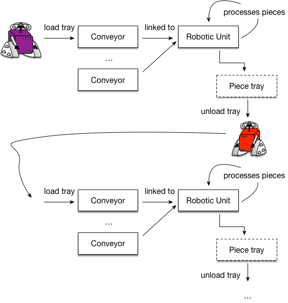

.. _pddl_tutorial_chapter:

PDDL Tutorial
=============================

What is PDDL?
-------------

PDDL (Planning Domain Description Language) is a standard encoding language for “classical” planning.

The components of PDDL files are:
  * *Requirements:* defining levels of abstraction in the language, e.g., "STRIPS", temporal, probabilistic effects etc.
  * *Types:* sets of the things of interest in the world,
  * *Objects:* instances of types,
  * *Predicates:* Facts about objects that can be true or false,
  * *Initial state* of the world: before starting the planning process,
  * *Goal:* properties of the world true in goal states and achieved after the planning process,
  * *Actions/Operators:* ways of changing states of the world and going from the initial state to goal states.

A planning task in PDDL is specified in two text files:
  #. A *domain file* for requirements, types, predicates and actions,
  #. A *problem file* for objects, initial state and goal specification.

Domain files are as follows:

.. code-block:: text

    (define (domain <domain name>)
        <PDDL code for requirements>
        <PDDL code for types>
        <PDDL code for predicates>
        <PDDL code for first action>
        [...]
        <PDDL code for last action>
    )

where ``<domain name>`` is a string that identifies the planning domain.

.. note::

    Many examples are available in ``src/test/resources/benchmarks/pddl``. Domains and problems are classified by
    competition year and by track

Problem files are as follows:

.. code-block:: text

    (define (problem <problem name>)
        (:domain <domain name>)
        <PDDL code for objects>
        <PDDL code for initial state>
        <PDDL code for goal specification>
    )

where:
    * ``<problem name>`` is the string that identifies the planning task, e.g. gripper with 4 balls to move.
    * ``<domain name>`` is the planning domain name corresponding to problem file.

.. note::

   Novices in PDDL should start by doing the :ref:`simple_running_example_section`. Advanced readers can go directly to
   the :ref:`industrial_use_case_section`.

.. _simple_running_example_section:

A Simple Running Example: Logistics
-----------------------------------

We will use the Logistics domain to illustrate how to represent a planning task in PDDL.

In logistics, there are trucks and airplanes that can move packages between different airports and cities. We assume
that in the initial state there is a truck in Paris airport. An airplane and two packages are in London airport. Paris
has two places : south and north. The goal is to have one package in the north location and the other one in the south
location.

.. todo::

    First, create two text files respectively called ``logistics.pddl`` and ``problem.pddl`` and copy
    paste the PDDL code fragment given step by step in theses files. You can choose whatever text
    editor you want

.. note::

    Remember that PDDL requires two files:
    1. A *domain file* for requirements, types, predicates and actions,
    2. A *problem file* for objects, initial state and goal specification.

Defining the Domain
~~~~~~~~~~~~~~~~~~~

Let start by defining in the file ``logistics.pddl`` the domain and its components :
    * the requirements,
    * the types,
    * the predicates,
    * the actions or the operators.

First, we have to define the name of the domain:

In PDDL, we write :

.. code-block:: text

    (define (domain logistics)

Requirements
****************

The requirements for this logistics example are:
  * **strips** : the actions will only use positive preconditions (predicates that must be true in the current state to trigger actions) and deterministic effects (effects that necessarily follow action triggering). Nothing else is allowed.
  * **typing** : we will use "types" like in OO programming to represent sets of objects in the world.

In PDDL, we write :

.. code-block:: text

    (:requirements :strips :typing)

Types
*********

We will use the following types:
  * Places, cities and physical objects are considered as objects,
  * Packages and vehicles are physical objects,
  * Trucks and airplanes are vehicles,
  * Airports and locations are places.

In PDDL, we write:

.. code-block:: text

    (:types city place physobj - object
          package vehicle - physobj
          truck airplane - vehicle
          airport location - place
    )

Predicates
**************

We will use the following predicates:
  * *in-city(loc, city)* - true iff a place *loc* is in the city *city*
  * *at(obj, loc)* - true iff a physical object *obj* is at place *loc*
  * *in(pkg, veh)* - true iff the a package *pkg* is in a vehicle *veh*

In PDDL, question marks are used for variables:

.. code-block:: text

    (:predicates (in-city ?loc - place ?city - city)
        (at ?obj - physobj ?loc - place)
    	(in ?pkg - package ?veh - vehicle)
    )

Operators
*********

We are going to define the operators of the actions of the logistics domain, i.e., the means to change the states of
the world. The domains has 5 operators: *load-truck*, *load-airplaine*, *unload-truck*, *unload-airplane*, *drive-truck*
and *fly-aiplane*.

.. note::

    In this tutorial, we will use indifferently the words "action" and "operator" (though in planning community, actions
    are ground operators, i.e., operator where variables are replaced by constants).

**Load Truck Operator**

For instance, in the logistics domain, a truck can be loaded... And to load a truck, we need a package *pkg* and a truck
*truck* at a place *loc*. To load *pkg* in *truck*, these two objects must be at the same place *loc*. The effects of
loading *pkg* in *truck* are that *in(pkg, truck)* becomes true and *at(pkg, loc)* becomes false. Any other fact in the
current state does not change:

.. code-block:: text

    (:action load-truck
        :parameters (?pkg - package ?truck - truck ?loc - place)
        :precondition (and (at ?truck ?loc) (at ?pkg ?loc))
        :effect (and (not (at ?pkg ?loc)) (in ?pkg ?truck))
    )

**Load Airplane Operator**

Action/Operator :
  * **Description** : Load a package *pkg* in an airplane *airplane* at a place *loc*,
  * **Precondition** : *at(pkg, loc)* and *at(airplane, loc)* must be true,
  * **Effect** : *in(pkg, airplane)* becomes true and *at(airplane, loc)* becomes false.

In PDDL:

.. code-block:: text

    (:action load-airplane
        :parameters (?pkg - package ?airplane - airplane ?loc - place)
        :precondition (and (at ?pkg ?loc) (at ?airplane ?loc))
        :effect (and (not (at ?pkg ?loc)) (in ?pkg ?airplane))
    )

**Unload Truck Operator**

Action/Operator :
  * **Description** : Unload a package *pkg* in a truck *truck* at a place *loc*,
  * **Precondition** : *in(pkg, truck)* and *at(truc, loc)* must be true,
  * **Effect** : *at(pkg, loc)* becomes true and *in(pkg, truck)* becomes false.

In PDDL:

.. code-block:: text

    (:action unload-truck
        :parameters (?pkg - package ?truck - truck ?loc - place)
        :precondition (and (at ?truck ?loc) (in ?pkg ?truck))
        :effect (and (not (in ?pkg ?truck)) (at ?pkg ?loc))
    )

**Unload Airplane Operator**

Action/Operator :
  * **Description** : Unload a package *pkg* in an airplane *airplane* at a place *loc*,
  * **Precondition** : *in(pkg, airplane)* and *at(airplane, loc)* must be true,
  * **Effect** : *at(pkg, loc)* becomes true and *in(pkg, airplane)* becomes false.

In PDDL:

.. code-block:: text

    (:action unload-airplane
        :parameters (?pkg - package ?airplane - airplane ?loc - place)
        :precondition (and (in ?pkg ?airplane) (at ?airplane ?loc))
        :effect (and (not (in ?pkg ?airplane)) (at ?pkg ?loc))
    )

**Fly-airplane Operator**

Action/Operator :
    * **Description** : Fly airplane *pkg* from a location *loc-from* to a location *loc-to*,
    * **Precondition** : *at(pkg, loc-from)* must be true,
    * **Effect** : *at(pkg, loc-to)* becomes true and *at(p, loc-from)* becomes false.

In PDDL:

.. code-block:: text

    (:action fly-airplane
        :parameters (?airplane - airplane ?loc-from - airport ?loc-to - airport)
        :precondition (at ?airplane ?loc-from)
        :effect (and (not (at ?airplane ?loc-from)) (at ?airplane ?loc-to))
    )

**Drive-truck Operator**

Action/Operator :
    * **Description** : Drive truck *truck* from a location *loc-from* to a location *loc-to*,
    * **Precondition** : *at(truck, loc-from)* must be true,
    * **Effect** : *at(truck, loc-to)* becomes true and *at(truck, loc-from)* becomes false.

In PDDL:

.. code-block:: text

    (:action drive-truck
        :parameters (?truck - truck ?loc-from - place ?loc-to - place ?city - city)
        :precondition (and (at ?truck ?loc-from) (in-city ?loc-from ?city) (in-city ?loc-to ?city))
        :effect (and (not (at ?truck ?loc-from)) (at ?truck ?loc-to))
    )

.. note::

    * Action preconditions and effects can be more complicated than seen so far. They can be universally or existentially quantified using PDDL statement of the form ``(forall (?v1 ... ?vn) <effect >)``. In that case, specific requirements must be used, for instance ``:adl``.
    * They can be conditional : ``(when <condition > <effect >)``
    * Action They can have costs, duration, time constraints etc.

Defining the Problem
~~~~~~~~~~~~~~~~~~~~

Now, let define in the file ``problem.pddl`` a simple problem and its components :
    * the objects,
    * the initial state,
    * the goal to reach.

First, we have to define the name of the problem and indicate the domain associated with this problem:

In PDDL, we write :

.. code-block:: text

    (define (problem p01)
            (:domain logistics)

Objects
*******

In this example, we use the following objects:
  * A Truck : *truck*
  * An airplane: *airplane*
  * Two airports : *cdg*, *lhr*
  * Two places : *north*, *south*
  * Two cities : *london*, *paris*
  * Two packages : *p1*, *p2*

In PDDL, we write:

.. code-block:: text

    (:objects plane - airplane
        truck - truck
        cdg lhr - airport
        south north - location
        paris london - city
        p1 p2 - package
    )

.. note::

    The types of the object can be only the types defined in the domain or the type ``object``.

Initial State
*****************

The initial state is a set of ground predicates. A predicate is ground iff all the variables are bound to objects.
The ground predicates in the initial state represent true facts in this state. Any fact that is not represented in a
state is false: In our case:

.. code-block:: text

    (:init (in-city cdg paris)
        (in-city lhr london)
        (in-city north paris)
        (in-city south paris)
        (at plane lhr)
        (at truck cdg)
        (at p1 lhr)
        (at p2 lhr)
    )

Goal Description
****************

The goal is to have *at(p1, north)* and *at(p2, south)* in the final state (no matter the truth value of the other
predicates). In PDDL, we write:

.. code-block:: text

    (:goal (and (at p1 north)
        (at p2 south))
    )

..  note::

    If you have not completed the files as you go, the domain :download:`logistics.pddl <resources/logistics.pddl>` file
    and the problem :download:`problem.pddl <resources/problem.pddl>` file can be downloaded directly.

.. todo::

    Run HSP planner on the logistics domain and the problem.

Running the logistics example
~~~~~~~~~~~~~~~~~~~~~~~~~~~~~

The procedure to run the logistic domain and problem with HSP planner of the library is given below:

    1. Open a terminal

    2. Create a directory called PDDL4J:

    .. code-block:: bash

        $ mkdir pddl4j

    3. Go to the directory:

    .. code-block:: bash

        $ cd pddl4j

    4. Download the binary of last release (X.X.X is the number of release - see :ref:`download_chapter`.

    .. code-block:: bash

        $ wget http://pddl4j.imag.fr/repository/pddl4j/binaries/pddl4j-4.0.0.jar

    5. Move the domain file :download:`logistics.pddl <resources/logistics.pddl>` previously created or download it in
    the ``pdd4j`` directory.

    6. Move the domain file :download:`problem.pddl <resources/problem.pddl>` previously created or download it in
    the ``pdd4j`` directory.

    7. Test the example:

    .. code-block:: bash

        $ java -jar pddl4j-X.X.jar -server -Xms2048m -Xmx2048m -p HSP -o logistics.pddl -f problem.pddl

    * The JVM (Java Virtual Machine) arguments:
        * ``-jar`` specified the executable jar of the library.
        * ``-XMS`` and  ``-XMX`` allow to set the maximum heap size and the maximum memory size that can be used by the JVM

    The result will be:

    .. code-block:: text

        parsing domain file "logistics.pddl" done successfully
        parsing problem file "problem.pddl" done successfully

        encoding problem done successfully (28 ops, 17 facts)

        found plan as follows:

        00: (        loadd-airplane p1 plane lhr) [1]
        01: (        loadd-airplane p2 plane lhr) [1]
        02: (         fly-airplane plane lhr cdg) [1]
        03: (       unload-airplane p1 plane cdg) [1]
        04: (       unload-airplane p2 plane cdg) [1]
        05: (            load-truck p1 truck cdg) [1]
        06: (            load-truck p2 truck cdg) [1]
        07: (  drive-truck truck cdg south paris) [1]
        08: (        unload-truck p2 truck south) [1]
        09: (drive-truck truck south north paris) [1]
        10: (        unload-truck p1 truck north) [1]

        plan total cost: 11,00

        time spent:  0,09 seconds parsing
                     0,03 seconds encoding
                     0,01 seconds searching
                     0,13 seconds total time

.. _industrial_use_case_section:

An Industrial Use Case
-------------------

Industrial Problem Description
^^^^^^^^^^^^^^^^^^^^^^^^^^^^^^

This is a real case that we tackled for a manufacturing company. This company devises supply chains to make pieces of medical equipments. A supply chain consists of independent robotized units/cells, which realize specific operations on the pieces: cleaning, checking, marking, assembling etc. The pieces are put on trays, and mobile robots are programmed to take and to transport the trays between the different units. The image below illustrates this process:

There are different kind of pieces at the beginning of the supply chain. A tray contains only one kind of pieces, and, each piece undergoes a sequence of operations from the beginning to the end of the supply chain. At the beginning of the supply chain, a unit is used to store all the trays. The units can have several inputs named "conveyors". The conveyors and the units are specific to a set of pieces: pieces are admissible to identified conveyors and units. Initially, every processing (unit loading/unloading, robot movements etc.) was hard-coded in a database by human operators. Automated planning is now used to optimize unit/robot scheduling and to increase production efficiency.

.. todo::
    * Try to write your own domain file for this problem.
    * Before reading the proposed solution below, write a simple problem file and test your domain. For instance, a simple problem is one type of pieces, a single tray, robot and conveyor; two units, a stocker storing this tray at the initial state and a processing unit. The goal is for the unit to perform three operations (op10 > op20 > op30) on the tray.

Defining the Domain
~~~~~~~~~~~~~~~~~~~

Requirements
************

Let start by creating the domain file. For instance, ``rsc-domain.pddl`` write the following PDDL to give a name to
this domain and specify the requirements of the domain.

.. code-block:: text

    (define (domain robotic-manufactoring)
        (:requirements :strips :typing)

Types
*****

Then, define the set of objects (types) that will be used in this domain. Quite obviously, we will have the types *robot*
(mobile robots), *conveyor*, *unit*, *piece*, etc.

.. code-block:: text

    (:types
        robot - agent
        conveyor unit - location
        piece operation tray - object
    )

Constants
*********

We also declare a dummy operation called *stop* as a constant of the domain which will be used in one action:

.. code-block:: text
    (:constants
        stop - operation
    )

Predicates
**********

.. note::
    Now it is time to think to a model for the domain. It is based on the following ideas:
        * *Producer/consumer:* the trays are resources consumed by the conveyors and produced by the units. A "one-to-many" relation is created between each unit and the conveyors. A tuple conveyors/unit is like a (Petri Net) "machine" that consumes and produces trays. The conveyors are the inputs and the unit is the output. Each input/output's capacity is one,
        * *Operation stacks:* each tray is associated to a stack of operations that have to be performed on the pieces of the tray. The last operation of the stack is always _stop_. Each time a machine consumes a tray, the associated stack is pulled,
        * *Goal:* to empty all the stacks by connecting the machines with robots transporting trays from units (outputs) to conveyors (inputs). The capacity of the robots is one.

Here is the vocabulary ("predicates") that will be used by the actions:

.. code-block:: text

    (:predicates
        ;;robot
        (robot_available ?robot - robot)
        ;; is the robot available? capacity is one
        (robot_at ?robot - robot ?l - location)
        ;; location of a robot. Either a conveyor or a unit

        ;;conveyor
        (conveyor_accepted_piece ?piece - piece ?conv - conveyor)
        ;; constraint on admissible pieces
        (conveyor_available ?conv - conveyor)
        ;; is the conveyor available? capacity is one
        (conveyor_unit ?conv - conveyor ?unit - unit)
        ;; "one-to-many" relation between units and conveyors

        ;;unit
        (unit_accepted_piece ?piece - piece ?unit - unit)
        ;; constraint on admissible pieces
        (unit_available ?unit - unit)
        ;; is the unit available? unit capacity is one
        (unit_operation ?op - operation ?unit - unit)
        ;; operation provided by the unit

        ;;tray
        (tray_on_unit ?tray - tray ?unit - unit)
        ;; the tray is in the unit
        (tray_on_conv ?tray - tray ?conv - conveyor)
        ;; the tray is input into the conveyor
        (tray_on_robot ?tray - tray ?robot - robot)
        ;; the robot is at the tray
        (tray_completed ?tray - tray)
        ;; all the scheduled operations are completed

        ;;piece
        (piece_on ?piece - piece ?tray - tray)
        ;; "one-to-one" relation: trays contain only one type of pieces

        ;;stack of operations
        (start ?op - operation ?tray - tray)
        ;; ?op is on top of the stack.
        ;; The stack has a one-to-one relation with the tray (same id)
        (todo ?opontop - operation ?nextop - operation ?tray - tray)
        ;; linked list of operations: ?nextop follows ?opontop. Last operation is stop
    )

For instance, in the problem file, you can now specify an initial state beginning by:

.. code-block:: text

    (start op10 tray32)
    (todo op10 op20 tray32)
    (todo op20 op30 tray32)
    (todo op30 stop tray32)

This means that the sequence *op10*, *op20*, *op30* of operations is scheduled on *tray32*.

Likewise,

.. code-block:: text

    (conveyor_unit conv1 unit1)
    (conveyor_unit conv2 unit1)

means that *unit1* has two inputs *conv1* and *conv2*.

Operators
*********

The new step is to define all the actions. For this domain, we will need 6 actions:

.. code-block:: text

    (:action pickup_tray_on_unit
        :parameters (?robot - robot ?unit - unit ?tray - tray)
        :precondition (and (robot_available ?robot)
                           (robot_at ?robot ?unit)
                           (tray_on_unit ?tray ?unit)
                       )
        :effect (and (not (tray_on_unit ?tray ?unit))
                     (not (robot_available ?robot))
                     (tray_on_robot ?tray ?robot)
                     (unit_available ?unit)
                )
    )

Action *pickup_tray_on_unit* allows a robot to pickup a tray on a unit provided the robot is available and located at this unit. The effects are that the tray is no more on the unit, the tray is on the robot and the robot is not available to pickup another tray. The unit becomes available to process another tray.

.. code-block:: text

    (:action drop_tray_on_conveyor
        :parameters (?robot - robot ?conv - conveyor ?tray - tray ?piece - piece)
        :precondition (and (conveyor_available ?conv)
                           (robot_at ?robot ?conv)
                           (tray_on_robot ?tray ?robot)
                           (conveyor_accepted_piece ?piece ?conv)
                           (piece_on ?piece ?tray)
                      )
        :effect (and (not (conveyor_available ?conv))
                     (not (tray_on_robot ?tray ?robot))
                     (tray_on_conv ?tray ?conv)
                     (robot_available ?robot))
    )

Action *drop_tray_on_conveyor* is the counterpart of *pickup_tray_on_unit*. It allows a robot to put a tray on a
conveyor. The preconditions are that the robot and the conveyor are in the same place, the conveyor is available and it
accepts the same type of pieces than the tray. The effects are that the conveyor is no more available, the tray is no
more on the robot (it is on the conveyor) and the robot is now available.

.. code-block:: text

    (:action robot_move
        :parameters (?robot - robot ?from - location ?to - location)
        :precondition (and (robot_at ?robot ?from))
        :effect (and (robot_at ?robot ?to)
                     (not (robot_at ?robot ?from))
                )
    )

Action *robot_move* is trivial: it moves a robot from location *?from$ to location $?to*. Locations are either a
conveyor or a unit (see *:types* keyword).

.. code-block:: text

    (:action conveyor_load_tray_in_unit
        :parameters (?conv - conveyor ?unit - unit ?tray - tray ?piece - piece)
        :precondition (and (unit_available ?unit)
                           (conveyor_unit ?conv ?unit)
                           (unit_accepted_piece ?piece ?unit)
                           (piece_on ?piece ?tray)
                           (tray_on_conv ?tray ?conv)
                      )
        :effect (and (not (tray_on_conv ?tray ?conv))
                     (not (unit_available ?unit))
                     (tray_on_unit ?tray ?unit))
        )

Action *conveyor_load_tray_in_unit* consumes a tray that is loaded on a conveyor linked to a unit provided the pieces of
the tray are accepted by this unit. As a consequence, the tray is no more one the conveyor, the unit is not available
and the tray is on the unit, ready for processing.

.. code-block:: text

    (:action unit_execute_operation
        :parameters (?unit - unit ?top - operation ?next - operation ?tray - tray)
        :precondition (and (unit_operation ?top ?unit)
                           (tray_on_unit ?tray ?unit)
                           (start ?top ?tray)
                           (todo ?top ?next ?tray)
                       )
        :effect (and (start ?next ?tray)
                     (not (todo ?top ?next ?tray))
                     (not (start ?top ?tray))
                )
        )

Action *unit_execute_operation* applies the operation pending on top of the tray's stack. The preconditions are that the
unit is able to perform this operation, the tray is in the unit and this operation operation is on top of the stack. The
effects are that the operation is pulled from the stack and the next operation becomes the top of the stack.

.. code-block:: text

    (:action tray_completed
        :parameters (?op - operation ?tray - tray ?unit - unit)
        :precondition (and (start stop ?tray)
                           (tray_on_unit ?tray ?unit)
                      )
        :effect (and (tray_completed ?tray)
                     (unit_available ?unit)
                     (not (tray_on_unit ?tray ?unit)))
        )

Action *tray_completed* is a dummy action which purpose is to check that all the scheduled operations on a tray have
been done (*stop* operation on top of the tray's stack). It is used to build a goal state and to terminate the planning
procedure for a given tray. Here we suppose that an operator picks up the tray once all the operations have been done
and the unit becomes available to process another tray.

Defining the problem
~~~~~~~~~~~~~~~~~~~~

Let start by creating the problem file, e.g., ``rsc_problem_easy.pddl``. The problem we wish to define is a simple problem with one
type of pieces, a single tray, robot and conveyor; two units, a stocker storing this tray at the initial state and a
processing unit. The goal is for the unit to perform three operations (*op10* > *op20* > *op30*) on the tray.

Objects
*******

Hence, the types and objects are as follows:

.. code-block:: text

    (:objects
        unit1 stocker - unit
        conv1 - conveyor
        robot1 - robot

        tray1 - tray
        piece1 - piece

        op10 op20 op30 - operation
    )

Initial State
*************

This snippet of code is the initial state:

.. code-block:: text

    (:init
        ;; Operation schedule
        (start op10 tray1)
        (todo op10 op20 tray1)
        (todo op20 op30 tray1)
        (todo op30 stop tray1)

        ;; Initiate pieces on tray
        (piece_on piece1 tray1)

        ;; At the beginning, tray1 is on the stocker
        (tray_on_unit tray1 stocker)

        ;; Initiate robot
        (robot_at robot1 stocker)
        (robot_available robot1)
        ;; Initiate conveyor
        (conveyor_unit conv1 unit1)
        ;; Setup unit
        (unit_accepted_piece piece1 unit1)
        (unit_accepted_piece piece1 stocker)
        (unit_operation op10 unit1)
        (unit_operation op20 unit1)
        (unit_operation op30 unit1)

        ;; Unit1 is ready
        (unit_available unit1)

        ;; Setup conveyor
        (conveyor_accepted_piece piece1 conv1)
        (conveyor_available conv1)

        ;; Setup robot
        (robot_available robot1)
  )

Goal Description
****************

The goal is simply the completion of *tray1*:

.. code-block:: text

    (:goal
        (and (tray_completed tray1))
    )

Complete files can be downloaded here:
    * :download:`rsc_domain.pddl <resources/rsc_domain.pddl>`
    * :download:`rsc_problem_easy.pddl <resources/rsc_problem_easy.pddl>`
    * :download:`rsc_problem_hard.pddl <resources/rsc_problem_hard.pddl>`

.. note::
    To go further, we recommend the reader to refer to this `good resource on PDDL <https://planning.wiki/>`_

